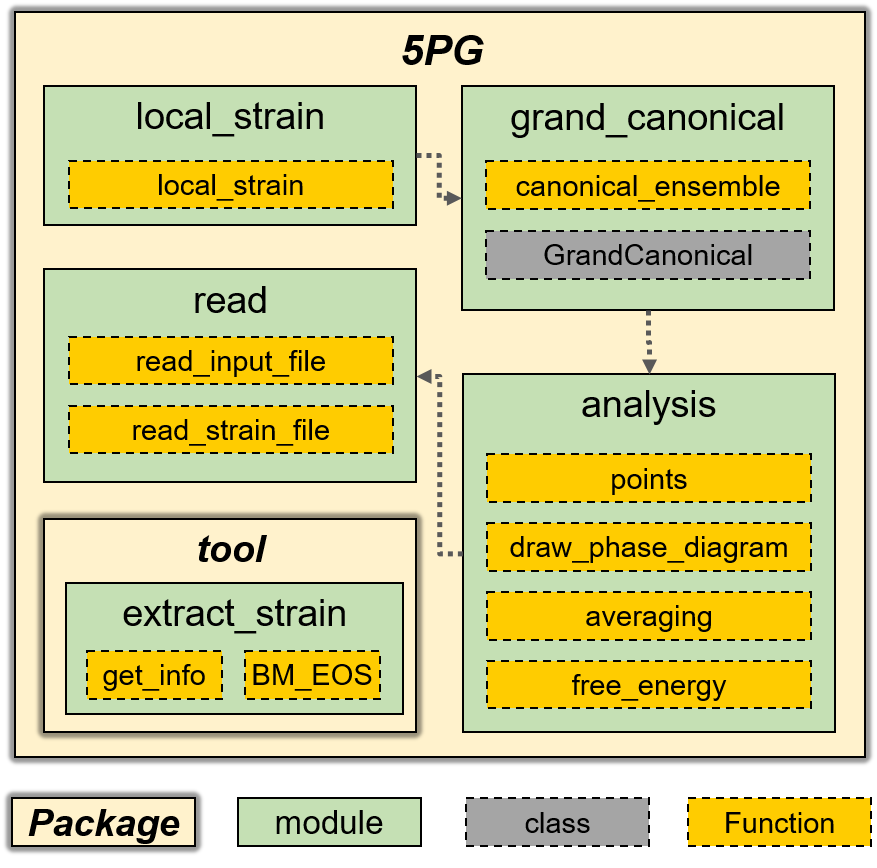

Architecture
============

**5PG** is composed of read.py, local_strain.py, grand_canonical_ensemble.py, phase_diagram.py, average_property.py, and util/extract_strain.py.

.. toctree::
    :maxdepth: 1
    :caption: Modules

    read
    analysis
    grand_canonical
    local_strain
    util
