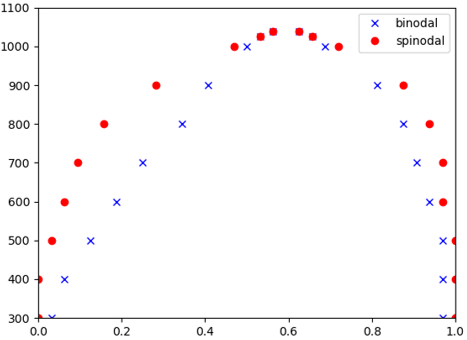

Phase diagram
=============

**P5Grand** can calculate the phase diagram of a pseudobinary system.

The basic command to calculate phase diagram is ::

 $ python /dir/to/P5Grand/__main__.py CEL.log -calc p

or ::

 $ python /dir/to/P5Grand CEL.log -calc p

Because default of ``-calc`` is `p`, `-calc p` is not essential.

We provide example files for testing a command `here <https://github.com/Han-Gyuseung/P5Grand/tree/main/example/thermodynamic>`_.
The log messages and phase diagram obtained from the example files is as follows:

::

 Datafile: CEL.log
 -strain : BM_constant.dat
 -unit   : eV
 -calc   : phase_diagram
 -Tmax   : 10000.0 K
 -Tmin   : 300.0 K
 -dT     : 100.0 K
 -dTmin  :  10.0 K
 
 Read CEL.log
 Read BM_constant.dat
 
 Final temperature :   1037.500 K
 
 

 
-------------------

.. contents::
   :depth: 2
   :local:

-------------------

options
-------

``-calc``
**********

| -calc `f` | `p` | `a`
| default : `p`

| The option to choose what to be calculated.
| `f` indicates free energy, `p` indicates phase diagram, and `a` indicates average property.
| To calculate free energy, ``-calc`` must be `p`.

::

 $ python /dir/to/P5Grand CEL.log -calc p

``-strain``
***********

| -strain `[fileName]`
| default : BM_constant.dat

| The option to select the input file for strain energy.

::

 $ python /dir/to/P5Grand CEL.log -calc p -strain BM_constant.dat

``-unit``
*********

| -unit `eV` | `J`
| default : `eV`

| The option to select energy unit of input file and strain energy.

::

 $ python /dir/to/P5Grand CEL.log -calc p -unit eV

``-Tmax``
*********

| -Tmax `[real >Tmax]`
| default : 10000
| unit : Kelvin

| The highest temperature to be calculated.
| If phase separation is not found below ``-Tmax``, P5Grand stop calculating before reaching ``-Tmax``

::

 $ python /dir/to/P5Grand CEL.log -calc p -Tmax 1000

``-Tmin``
*********

| -Tmax `[real >Tmax]`
| default : 300
| unit : Kelvin

| The starting temperature of the calculation.
| The lowest temperature to be calculated.

::

 $ python /dir/to/P5Grand CEL.log -calc p -Tmin 200

``-dT``
*********

| -Tmax `[real]`
| default : 100
| unit : Kelvin

| The basic temperature step to be calculated.

::

 $ python /dir/to/P5Grand CEL.log -calc p -dT 10

``-dTmin``
**********

| -Tmax `[real <dT]`
| default : dT/10
| unit : Kelvin

| The minimum temperature step.
| The temperature step can be reduced down to the ``-dTmin`` value to obtain more precise phase diagram.

::

 $ python /dir/to/P5Grand CEL.log -calc p -dTmin 100

``-points``
***********

| -points `[integer > 1]`
| default : 32

| The number of calculated compositions -1. The composition interval is set as 1/[int]

::

 $ python /dir/to/P5Grand CEL.log -calc p -points 50
