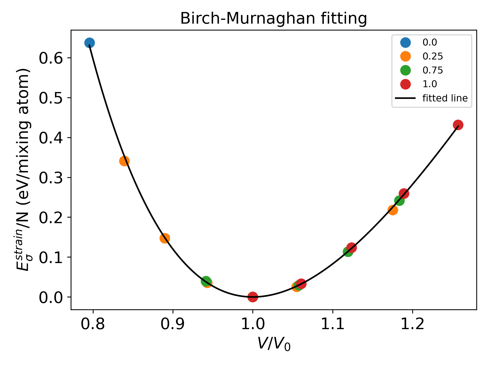

tool/extract_strain
~~~~~~~~~~~~~~~~~~~

**P5Grand** provides ``tool/extract_strain.py`` script to generate a file containing fitting parameters.
``tool/extract_strain.py`` script extracts parameters for local strain from the ``OUTCAR`` of **VASP**, and automatically write them in a file named ``BM_constant.dat``.

For each configuration, directories must be treed as below. 

::

 configuration
 ├── unstrained
 │   └── OUTCAR
 ├── 0_strain
 │   └── OUTCAR
 ├── 	.
 │   	.
 ├── 	.
 │   	.
 └── n_strain
     └── OUTCAR

.. Note::

 Directory named ``unstrained`` which calculates freely relaxed state is essential.
 
 Other directories involves the calculation results for strained state.
 
 Every lowest subdirectory must involve ``OUTCAR``.

Overall directory tree is follows.

::

 strain
 ├── x_equal_0_and_1_must_be_included
 │   ├── 0
 │   │   ├── 0_strain
 │   │   │   └── OUTCAR
 │   │   ├──     .
 │   │   │       .
 │   │   ├──     .
 │   │   │       .
 │   │   ├── n_strain
 │   │   │   └── OUTCAR
 │   │   └── unstrained 
 │   │       └── OUTCAR
 │   └── 1
 │       ├── 0_strain
 │       │   └── OUTCAR
 │       ├──     .
 │       │       .
 │       ├──     .
 │       │       .
 │       ├── n_strain
 │       │   └── OUTCAR
 │       └── unstrained
 │           └── OUTCAR 
 ├── configuration_1
 │   ├── 0_strain
 │   │   └── OUTCAR
 │   ├── 	.
 │   │   	.
 │   ├── 	.
 │   │   	.
 │   ├── n_strain
 │   │   └── OUTCAR
 │   └── unstrained
 │       └── OUTCAR
 ├── configuration_2
 │   ├── 0_strain
 │   │   └── OUTCAR
 │   ├── 	.
 │   │   	.
 │   ├── 	.
 │   │   	.
 │   ├── n_strain
 │   │   └── OUTCAR
 │   └── unstrained
 │       └── OUTCAR
 ├──         .
 │           .
 ├──         .
 │           .
 └── configuration_n
     ├── 0_strain
     │   └── OUTCAR
     ├── 	.
     │   	.
     ├── 	.
     │   	.
     ├── n_strain
     │   └── OUTCAR
     └── unstrained
         └── OUTCAR

.. Note:: Directories for x=0 and x=1 must be included.

The basic command to extract the parameters for local strain from the OUTCAR of **VASP**. Enter this command in ``strain`` directory above.

::

 $ python /dir/to/P5Grand/tool/extract_strain.py atomA atomB

We provide an example for testing a command at `example/strain <https://github.com/Han-Gyuseung/P5Grand/tree/main/example/strain>`_.
The materials for example is GaAs\ :sub:`x`\ Sb\ :sub:`1-x`\ . For the test with example, the command become:

::

 $ python /dir/to/P5Grand/tool/extract_strain.py As Sb
 
You can get ``BM_constant.dat`` file and fitting graph as follows.

The fitting equations can be manually modified by editing the ``tool/extract_strain.py`` script.
